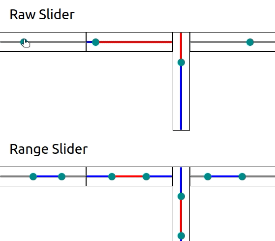

# React Native Slider

This lightweight version of a slider is fully compatible with React-Native and React-Native-Web.
It also provides support for Range slider (with 2 thumbs).

 * **Same API** as @react-native-community/slider (with some more features of course!)
 * **lightweight**
 * **Range slider** for sliders with min and max values
 * Supports for **React-Native-Web**
 * **No extra dependencies!**



## Install

```
npm i -S @sharcoux/slider
```

## Usage

### Slider

You can see below the available props with their respective default values

```javascript
import { Slider } from '@sharcoux/slider'

<Slider
  value={0}                         // set the current slider's value
  minimumValue={0}                  // Minimum value
  maximumValue={1}                  // Maximum value
  step={0}                          // The step for the slider (0 means that the slider will handle any decimal value within the range [min, max])
  minimumTrackTintColor='grey'      // The track color before the current value
  maximumTrackTintColor='grey'      // The track color after the current value
  thumbTintColor='darkcyan'         // The color of the slider's thumb
  thumbStyle={undefined}            // Override the thumb's style
  trackStyle={undefined}            // Override the tracks' style
  minTrackStyle={undefined}         // Override the tracks' style for the minimum range
  maxTrackStyle={undefined}         // Override the tracks' style for the maximum range
  vertical={false}                  // If true, the slider will be drawn vertically
  inverted={false}                  // If true, min value will be on the right, and max on the left
  enabled={true}                    // If false, the slider won't respond to touches anymore
  trackHeight={4}                   // The track's height in pixel
  thumbSize={15}                    // The thumb's size in pixel
  slideOnTap={true}                 // If true, touching the slider will update it's value. No need to slide the thumb.
  onValueChange={undefined}         // Called each time the value changed. The type is (value: number) => void
  onSlidingStart={undefined}        // Called when the slider is pressed. The type is (value: number) => void
  onSlidingComplete={undefined}     // Called when the press is released. The type is (value: number) => void
  {...props}                        // Add any View Props that will be applied to the container (style, ref, etc)
/>
```

### **Range Slider**

You can see below the available props with their respective default values

```javascript
import { RangeSlider } from '@sharcoux/slider'

<RangeSlider
  range={[0, 1]}                    // set the current slider's value
  minimumValue={0}                  // Minimum value
  maximumValue={1}                  // Maximum value
  step={0}                          // The step for the slider (0 means that the slider will handle any decimal value within the range [min, max])
  minimumRange={step || 0}          // Minimum range between the two thumbs
  crossingAllowed={false}           // If true, the user can make one thumb cross over the second thumb
  outboundColor='grey'              // The track color outside the current range value
  inboundColor='grey'               // The track color inside the current range value
  thumbTintColor='darkcyan'         // The color of the slider's thumb
  thumbStyle={undefined}            // Override the thumb's style
  trackStyle={undefined}            // Override the tracks' style
  minTrackStyle={undefined}         // Override the tracks' style for the minimum range
  midTrackStyle={undefined}         // Override the tracks' style for the middle range
  maxTrackStyle={undefined}         // Override the tracks' style for the maximum range
  vertical={false}                  // If true, the slider will be drawn vertically
  inverted={false}                  // If true, min value will be on the right, and max on the left
  enabled={true}                    // If false, the slider won't respond to touches anymore
  trackHeight={4}                   // The track's height in pixel
  thumbSize={15}                    // The thumb's size in pixel
  slideOnTap={true}                 // If true, touching the slider will update it's value. No need to slide the thumb.
  onValueChange={undefined}         // Called each time the value changed. The type is (range: [number, number]) => void
  onSlidingStart={undefined}        // Called when the slider is pressed. The type is (range: [number, number]) => void
  onSlidingComplete={undefined}     // Called when the press is released. The type is (range: [number, number]) => void
  {...props}                        // Add any View Props that will be applied to the container (style, ref, etc)
/>
```

## Slider V5

In version 5, I removed the Animated API as it cannot work on mobile until [this issue](https://github.com/facebook/react-native/pull/27506) is fixed by Facebook.

On the other hand, the default implementation should have received a performance boost that would make the Animated version theoretically useless.

I also added a prop `slideOnTap` to define if the slider should change it's value when pressing it, or only on slide.

### Changelog V 5.3.0:

 * new `minTrackStyle` prop on Slider and RangeSlider
 * new `maxTrackStyle` prop on Slider and RangeSlider
 * new `midTrackStyle` prop on RangeSlider

### Changelog V 5.2.0:

 * Adding a default padding of 10 on the ResponderView so that the touches events are more easily catched by the slider.

### Changelog V 5.1.0:

 * new `crossingAllowed` prop on RangeSlider
 * new `minimumRange` prop on RangeSlider

### Changelog V 5.0.0:

 * Remove `AnimatedSlider` and `AnimatedRangeSlider`
 * new `slideOnTap` prop
 * performance boost

If you have any issue, please fill an issue [on our repo](https://github.com/Sharcoux/slider/issues)
